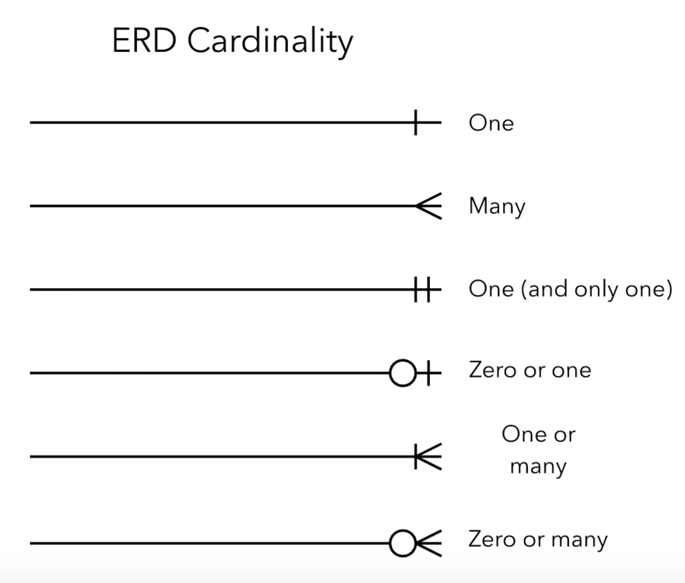

# db-design

## DB normalization (normal forms)
- Attributes should only have single (atomic) values.
- Each column depends on the entire primary key.

- No transitive dependency.


### Inner Joins
#### Select records that share the same key between tables.
``` sql
-- select customer.* from customer -- only select attributes from table customer
-- select customer_order.* from customer -- only select attributes from table customer_order
select * from customer
join customer_order on customer.id = customer_order.customer_id
join order_item on customer_order.id = order_item.order_id
join product on order_item.product_id = product.id;
```
### Left Joins
#### Select records from the left table with matching right table records
``` sql
select * from customer
left join customer_order on customer.id = customer_order.customer_id
where customer_order.id is null;
``` 
### Right Join
#### Select records from the right table with matching right table records.
``` sql
select * from customer
right join customer_order on customer.id = customer_order.customer_id
where customer_order.id is null;
``` 
### Full Join
``` sql
select * from customer
full join customer_order on customer.id = customer_order.customer_id
where customer_order.id is null;
```
### Transaction
- Atomicity guarantees that the transaction completes in an all-or-nothing manner.
- Consistency ensures that the change to data written to the database must be valid and follow predefined
- Isolation determines how transaction integrity is visible to other transactions.
- Durability makes sure that transactions that have been committed will be stored in the database permanently.
``` sql
begin;

update accounts
set balance = balance - 200
where id = 1;
update accounts
set balance = balance + 200
where id = 2;

commit;
```

Nested Transactions
``` sql
begin;

begin; -- this block transaction is commited although the below transaction is failed.
update accounts
set balance = balance - 200
where id = 1;
commit; 

begin; -- this block transaction will be rolled back.
update accounts
set balance = balance + 200
where id = 2;
rollback;

commit;
```

### View Indexes Trough Terminal
```sql
select tablename, indexname, indexdef from pg_indexes where schemaname = 'public';
```
```console
\d <table_name>
```
Create and Drop Indexes
```sql
create index accounts_balance_idx on accounts(balance);
drop index accounts_balance_idx ;
```
### Multi Column Indexes

```sql
create index people_first_name_last_name_idx on people(first_name, last_name);
-- ... where first_name = '' and last_name = ''; -> fast query
-- ... where first_name = ''; -> fast query
-- ... where last_name = ''; -> slow query
```

### Functions
```sql
create or replace function count_by_first_name(p_first_name text) -- define function
    returns int
    language plpgsql
as
$$
declare
       total int;
begin
    select count(*)
    into total
    from people
    where first_name = p_first_name;
    return total;
end;
$$;

select count_by_first_name('Jesus'); -- use function

drop function count_by_first_name; -- delete function

```


### Roles
```sql
create role maria with login password 'password';
create user maria with login password 'password'; -- user is alias of role
create role alex superuser login password 'password';
```
### Privileges
Privileges is about the ability to create select update delete tables.
```sql
grant select on table_name to user_name;
revoke all on all tables in schema public from maria; -- remove priviledges
```

### What are Schemas
Schema is namespace that contains database objects such as table, indexes, function, view inorder to organize object in order group.
search_path showing the default schema to select objects from.
```sql
show search_path;
set search_path to marketing, public; -- Now all query will default select from marketing schema instead of public.
```

### Backing up Databases
```sql
pg_dump -U postgres -F p db_name > db_back_up.sql; -- backup a db
psql -U user_name -d db_name -f db_back_up.sql; -- create a db from back up file.
```
